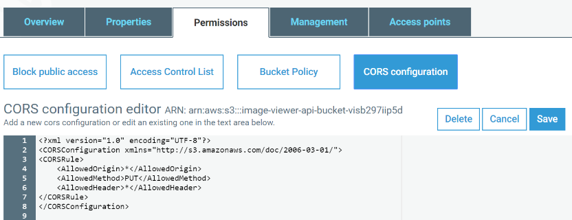

# Part 1 – Create Image Viewer API

## Create Docker image with API

The source code of the Image Viewer API is located in the **samples/ImageViewer.API** folder. The main goal of the API is to work with S3 Bucket and manage images there. Additionaly, it notifies other parts about uploaded images via AWS SQS. Please examine the source code.

1. The first step is to create a **Docker repository** in the AWS ECR where we will store the images. We name it **image-viewer-api**.

    ```bash
    aws ecr create-repository --repository-name image-viewer-api
    ```

2. Grab the repository's url in the previous command output or get it via command.

    ```bash
    aws ecr describe-repositories
    ```

3. Login to the repository using the next command. Just **replace** the repository url.
    
    ```bash
    aws ecr get-login-password | docker login --username AWS --password-stdin 44444444444.dkr.ecr.eu-west-1.amazonaws.com/image-viewer-api
    ```

4. Then we need to prepare a Docker image **image-viewer-api** with our API. Go to the **ImageViewer.API** folder where the **Dockerfile** is placed and execute the next command, it will build API and create the required image.

    ```bash
    docker build . -t image-viewer-api
    ```

5. **Tag** image with repository url and a first version.

    ```bash
    docker tag image-viewer-api:latest 44444444444.dkr.ecr.eu-west-1.amazonaws.com/image-viewer-api:0.1
    ```

6. **Push** image to the AWS Docker repository.

    ```bash
    docker push 44444444444.dkr.ecr.eu-west-1.amazonaws.com/image-viewer-api:0.1
    ```
## Deploy API to AWS

We will use AWS CloudFormation script, which will spin up the AWS Fargate cluster with our API and API Gateway on top of that. Additionally it will create two AWS SQS queues, that will be used for messaging. You can examine it in the **ImageViewer.API** folder, check **image-viewer-api.yaml** .

1. The CloudFormation script requires several parameters in order to know where to create its components. The first one is to get **VPC ID**, you can provide it by yourself or get default via the next command 

    ```bash
    aws ec2 describe-vpcs --filters Name=isDefault,Values=true --query 'Vpcs[*].VpcId' --output text
    ```

2. The same for **Subnets**, we need two IDs. They can be retrieved using command

    ```bash
    aws ec2 describe-subnets --query 'Subnets[*].SubnetId' --output text
    ```

3. Make sure you are in the **ImageViewer.API** folder and execute the next command to deploy required infrastructure. But before replace the next parameters
    - **Image** - the url to the Docker image at AWS ECR
    - **VPC** - the VPC Id from the step **1**
    - **SubnetA** - the first Subnet Id from the step **2**
    - **SubnetB** - the second Subnet Id from the step **2**
    - **S3Bucket** - the name of S3 Bucket for storing images, for ex. **image-viewer-images**. Choose your unique bucket name.

    ```bash
    aws cloudformation deploy --force-upload --no-fail-on-empty-changeset \
    --stack-name image-viewer-api-containers \
    --template-file image-viewer-api.yaml \
    --capabilities CAPABILITY_NAMED_IAM \
    --parameter-overrides Image=44444444444.dkr.ecr.eu-west-1.amazonaws.com/image-viewer-api:0.1 \
    VPC=vpc-3243kj SubnetA=subnet-32432kmn SubnetB=subnet-3245jjj \
    S3Bucket=image-viewer-images
    ```
4. You can check the deployment status and created resources via **CloudFormation UI** at AWS Console, find there **image-viewer-api-containers** stack

## Configure CORS for S3

1. Open **AWS Console** and go to the **S3** service
2. Open bucket with images
3. Navigate to **Permissions -> CORS configuration**

    

4. Enter the next configuration script and press **Save**

    ```xml
    <?xml version="1.0" encoding="UTF-8"?>
    <CORSConfiguration xmlns="http://s3.amazonaws.com/doc/2006-03-01/">
    <CORSRule>
        <AllowedOrigin>*</AllowedOrigin>
        <AllowedMethod>PUT</AllowedMethod>
        <AllowedHeader>*</AllowedHeader>
    </CORSRule>
    </CORSConfiguration>
    ```

5. Test that APIs are working.

    - Upload test image to S3. Open **AWS Management Console** and go to the **S3** service.
    - Select the created bucket for images. Press **Upload** and choose any image on your computer.
    - Look at the  **image-viewer-api-containers** stack outputs and grab the created API’s url. Copy **Endpoint** value, add **/api/s3proxy/** suffix to it and call. For example, <https://jhsjhfds33.execute-api.eu-west-1.amazonaws.com/Prod/api/s3proxy/>
    - The request should return the list of uploaded S3 images.

Great, we have working APIs, then we need to secure them [Part 2 – Secure your application](../part2/part.md)
