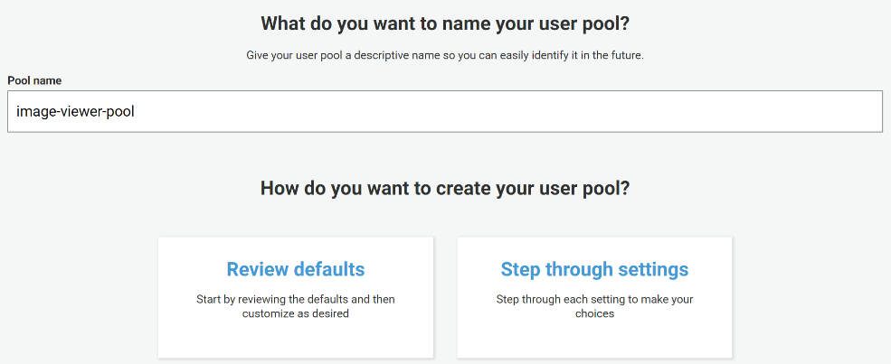
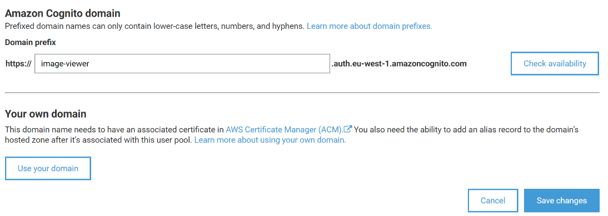
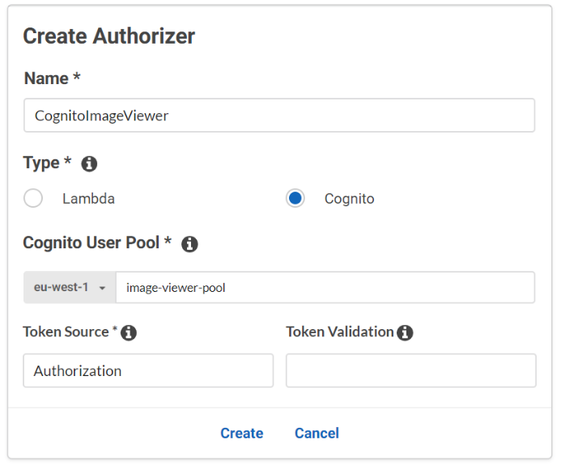
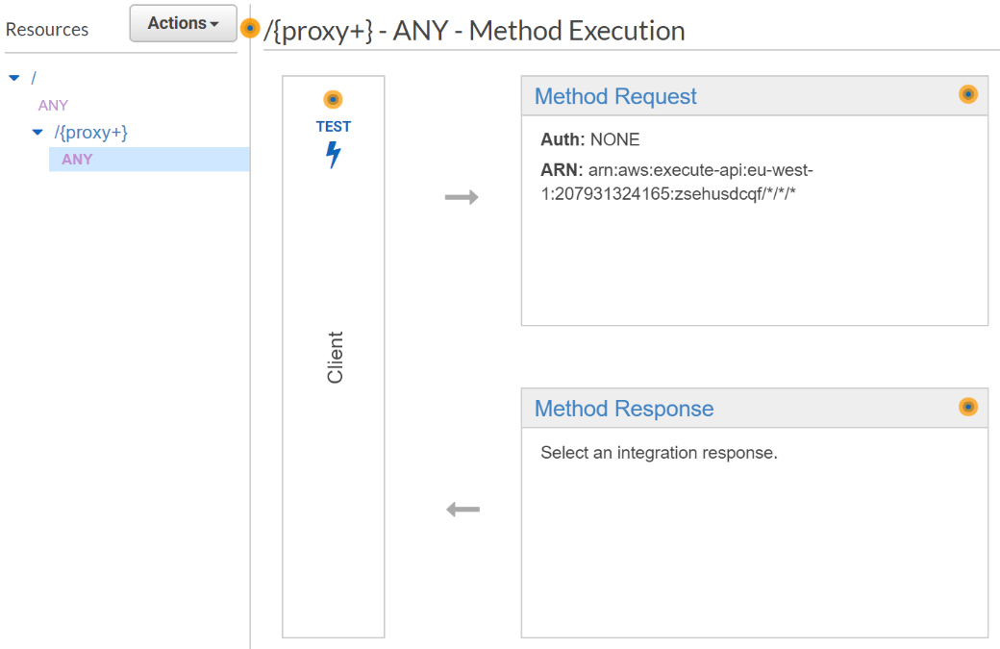
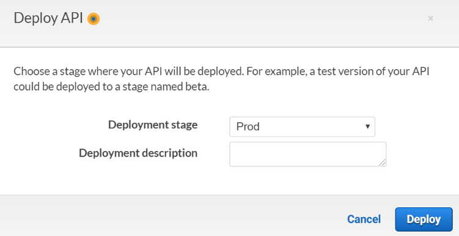

# Part 2 – Secure your application

## Create a Cognito User Pool

1. Create a new **Cognito User Pool** by navigating to the **Cognito** service in the **AWS Console** and choose **Manage User Pools** option
2. Press **Create** a user pool button
3. At the **New User Pool** screen:

    

    - Enter a user pool name **image-viewer-pool**
    - Click **Review defaults**
    - Leave everything by default and press **Create** pool

## Create an App Client

1. Select **App clients** tab
    - Press **Add an app client**
    - Name: **ImageViewerApp**
    - Generate **Client secret** - checked
2. Press **Create** client

## Create a Cognito Domain

1. Open the newly created pool and navigate to the **Domain name** under **App Integration** menu
2. Enter domain **image-viewer** or similar name that is available.

    

3. Press **Save changes**

## Configure an App Client

1. Go to the **App client settings** under **App integration** section
2. Set the following settings
    - Enable Identity Providers – Select all
    - Callback URL(s) - <http://localhost:4200/auth/callback/>
    - Allowed OAuth Flows – **Authorization code grant** and **Implicit grant**
    - Allowed OAuth Scopes – phone, email, openid

     

## Add a Cognito Authorizer

1. Go to the **API Gateway** service in the **AWS Console**
2. Select **Image Viewer API**
3. Go to the **Authorizers** tab and press **Create New Authorizer**

     

4. Enter the next settings
    - Name - any name, for ex. CognitoImageViewerAuthorizer
    - Type – **Cognito**
    - Cognito User Pool – select **image-viewer-pool**
    - Token Source – **Authorization**
    - Token Validation – leave blank

     

5. And press **Create**

## Secure methods with Authorizer

1. Go to **Resources**

     

2. Select **{proxy+} ANY** method

     

3. Refresh the web page in order to load new authorizers, just press F5. Then go to the **Method Request** settings
4. Select the corresponding **Cognito authorizer** and **save** changes.

     

5. Open **Actions** dropdown

     

6. Press **Deploy API**
7. Select **Prod** deployment stage and press **Deploy**

     

8. Wait 20-30 seconds and try to call API. For example <https://zfdsfsdfsdg.execute-api.eu-west-1.amazonaws.com/Prod/api/s3proxy/>
9. The following unauthorized message should be responded.

    ~~~json
    {"message":"Unauthorized"}
    ~~~

The API now secured and available for requests with a valid **Authorization** header. The header must contain an **id_token** generated by Cognito. Let's create a web client for our API [Part 3 – Deploy Image Viewer Web application](../part3/part.md)
