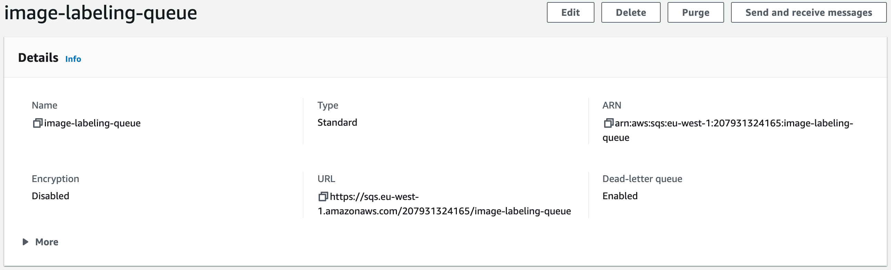

# Part 4 – Add Image Viewer labeling service

## Create Docker image with Labeling service

The source code of the Image Viewer Labeling service is located in the **samples/ImageViewer.Labeling** folder. The main goal of the Labeling service is to listen the AWS SQS queue for the new messages with info about uploaded images. Then label them using AWS Rekognition service and tag S3 Bucket objects with produced labels. Please examine the source code.

1. The first step is to create a **Docker repository** in the AWS ECR where we will store the images. We name it **image-viewer-labeling**.

    ```bash
    aws ecr create-repository --repository-name image-viewer-labeling
    ```

2. Grab the repository's url in the previous command output or get it via command.

    ```bash
    aws ecr describe-repositories
    ```

3. Login to the repository using the next command. Just **replace** the repository url.
    
    ```bash
    aws ecr get-login-password | docker login --username AWS --password-stdin 44444444444.dkr.ecr.eu-west-1.amazonaws.com/image-viewer-labeling
    ```

4. Then we need to prepare a Docker image **image-viewer-labeling** with our Labeling service. Go to the **ImageViewer.Labeling** folder where the **Dockerfile** is placed and execute the next command, it will build Labeling service and create the required image.

    ```bash
    docker build . -t image-viewer-labeling
    ```

5. **Tag** image with repository url and a first version.

    ```bash
    docker tag image-viewer-labeling:latest 44444444444.dkr.ecr.eu-west-1.amazonaws.com/image-viewer-labeling:0.1
    ```

6. **Push** image to the AWS Docker repository.

    ```bash
    docker push 44444444444.dkr.ecr.eu-west-1.amazonaws.com/image-viewer-labeling:0.1
    ```
## Deploy Labeling service to AWS

We will use AWS CloudFormation script, which will spin up the AWS Fargate cluster with our Labeling service. You can examine it in the **ImageViewer.Labeling** folder, check **image-viewer-labeling.yaml** .

1. The CloudFormation script requires several parameters in order to know where to create its components. The first one is to get **VPC ID**, you can provide it by yourself or get default via the next command 

    ```bash
    aws ec2 describe-vpcs --filters Name=isDefault,Values=true --query 'Vpcs[*].VpcId' --output text
    ```

2. The same for **Subnets**, we need two IDs. They can be retrieved using command

    ```bash
    aws ec2 describe-subnets --query 'Subnets[*].SubnetId' --output text
    ```

3. Go to the **AWS SQS** in AWS Console and grab Queue **URL** and **ARN**.

   

4. Make sure you are in the **ImageViewer.API** folder and execute the next command to deploy required infrastructure. But before replace the next parameters
    - **Image** - the url to the Docker image at AWS ECR
    - **VPC** - the VPC Id from the step **1**
    - **SubnetA** - the first Subnet Id from the step **2**
    - **SubnetB** - the second Subnet Id from the step **2**
    - **S3Bucket** - the name of S3 Bucket where images are stored
    - **QueueUrl** - the Queue URL from the step **3**
    - **QueueArn** - the Queue ARN from the step **3**

    ```bash
    aws cloudformation deploy --force-upload --no-fail-on-empty-changeset \
    --stack-name image-viewer-labeling-containers \
    --template-file image-viewer-labeling.yaml \
    --capabilities CAPABILITY_NAMED_IAM \
    --parameter-overrides Image=207931324165.dkr.ecr.eu-west-1.amazonaws.com/image-viewer-labeling:0.1 \
    VPC=vpc-435fef SubnetA=subnet-3243dfef SubnetB=subnet-34fdf \
    S3Bucket=image-viewer-images \
    QueueUrl=https://sqs.eu-west-1.amazonaws.com/207931324165/image-labeling-queue \
    QueueArn=arn:aws:sqs:eu-west-1:207931324165:image-labeling-queue
    ```
5. You can check the deployment status and created resources via **CloudFormation UI** at AWS Console, find there **image-viewer-labeling-containers** stack

6. Try to label new images.
    - Open the **Image Viewer** web site and upload new image.
    - Find new image in the table and examine created tags for it. It may take some time so use a **Refresh** button to update table

**Congrats!** You have completed the workshop! Do not forget to remove created resources. Follow instructions from the [Part 5 – Clean-up resources](../part5/part.md) section.
